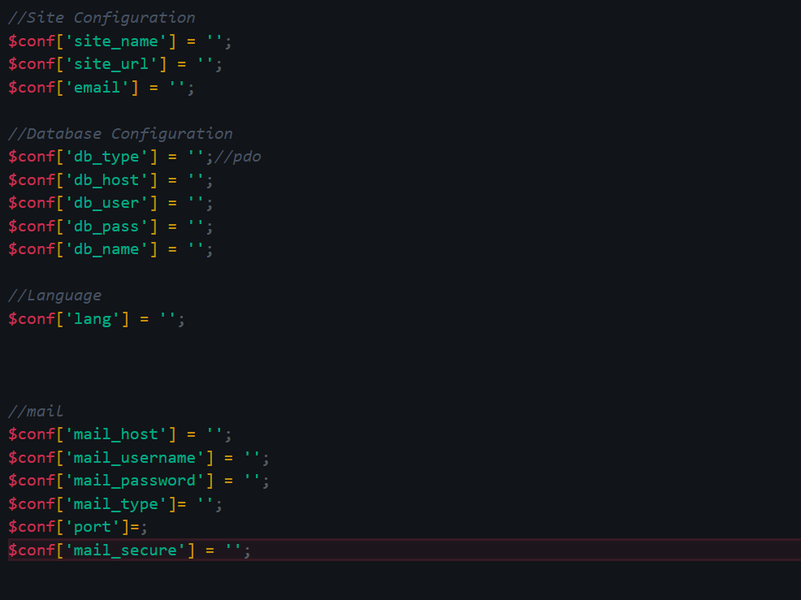

# Internet Application Programming
A repository contatining all the things learnt during the Internet Application Programming class.

All tasks can be found in the TaskApp folder

Please ensure that a conf file is included in your root folder.
It should look something like this:

---

<h3>Task 1</h3>
Validating email using phpMailer and php OOP concepts.

The createAccount form can be found in the forms folder in the `form.php` file on line 6.
The verifyEmail function can be found in the PHPMailer folder in the `mail.php` on line 59.

